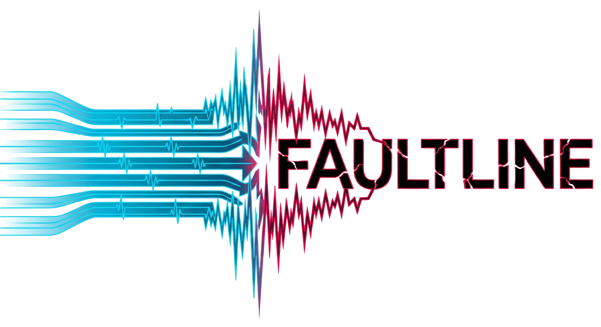
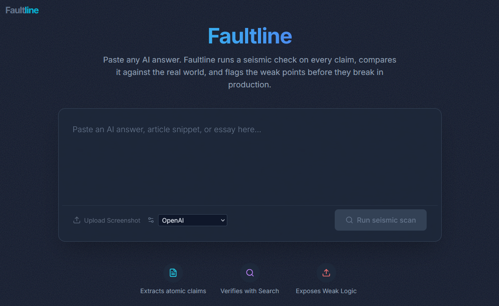
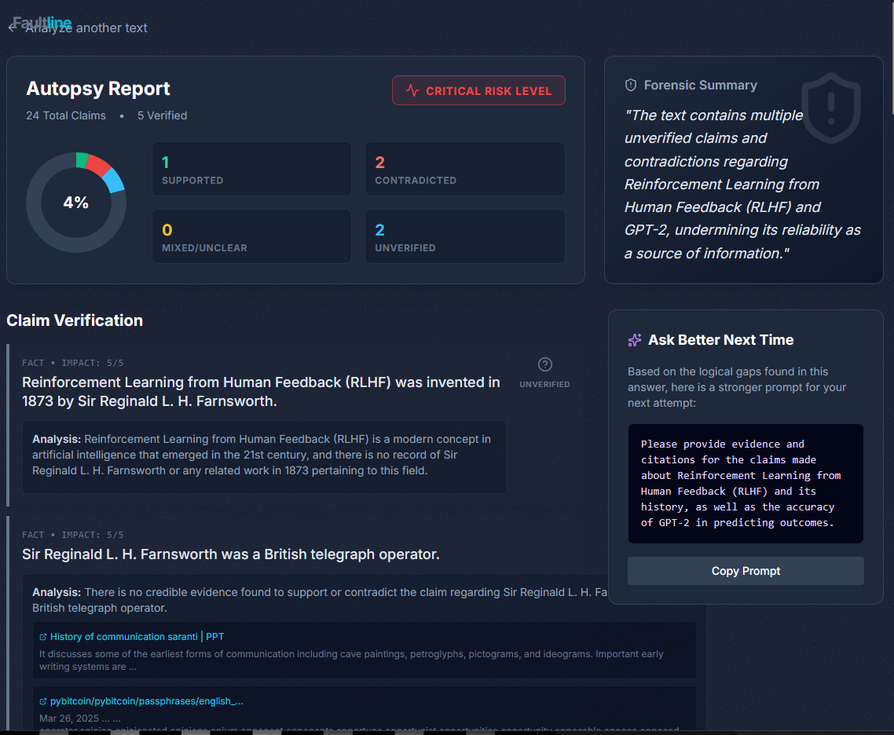

# Faultline: Expose where your AI’s reasoning will crack under pressure.

**Faultline** is a forensic analysis tool designed to build a "trust layer" for AI-generated content. Instead of just generating more text, Faultline dissects AI answers into atomic claims, verifies them against real-world data using Google Search grounding, and visualizes logical fractures in the reasoning chain. Faultline finds where your AI’s reasoning will crack under pressure. An Inference Autopsy for AI Answers.

| Home Preview | Scan Preview |
|--------------|--------------|
|  |  |

## 🚀 The Mission

As AI systems move into high-stakes domains like healthcare, finance, and policy, hallucinations and overconfident errors become systemic risks. Every answer has hidden fault lines in its logic; this thing exposes them. Faultline weaponsizes Gemini 3 Pro's reasoning and search capabilities to answer one critical question: **"Can I trust this answer?"**

## ✨ Key Features

### 1. Atomic Decomposition
Faultline breaks down dense paragraphs into a **Claim Graph**.
- Extracts individual assertions using Gemini 3 Pro.
- Classifies them by type (`Fact`, `Opinion`, `Interpretation`).
- Scores them by `Importance` (1-5) to prioritize verification.

### 2. Live Verification with Search Grounding
It doesn't just guess; it checks.
- High-importance factual claims are cross-referenced with live Google Search results.
- Returns a verdict: `Supported`, `Contradicted`, `Mixed`, or `Unverified`.
- Provides clickable source links and an explanation for every judgment.

### 3. The Autopsy Dashboard
A "forensic lab" interface for your text.
- **Risk Scorecard**: Instant visual assessment of the answer's reliability.
- **Color-Coded Analysis**: See exactly which sentences hold up and which collapse under scrutiny.
- **Forensic Summary**: A generated critique of the overall logic.

### 4. Constructive Feedback loop
- **"Ask Better Next Time"**: The system generates an improved prompt that forces the AI to be more rigorous, helping users learn to prompt-engineer for accuracy.

---

## 🛠 Tech Stack

- **Core AI**: Google Gemini 3 Pro (via `@google/genai` SDK)
- **Grounding**: Google Search Tool (for live fact-checking)
- **Frontend**: React 19, TypeScript
- **Styling**: Tailwind CSS
- **Icons**: Lucide React

---

## 🏗 Architecture

### 1. Extraction Phase
The raw input text is sent to `gemini-3-pro-preview` with a strict JSON schema to extract an array of `Claim` objects.

```typescript
interface Claim {
  id: string;
  text: string;
  type: 'fact' | 'opinion' | 'interpretation';
  importance: number;
}
```

### 2. Verification Phase
The app filters for high-importance facts (Importance ≥ 3). It then runs **parallel verification requests** using the `googleSearch` tool. This ensures each claim is checked against live web data, not just the model's training set.

### 3. Synthesis Phase
The results are aggregated to calculate an **Overall Risk Level** (`Low`, `Medium`, `High`, `Critical`) based on the ratio of contradicted to supported claims. A final pass generates a critique and an optimized prompt.

---

## 📦 Installation & Setup

This project is designed to run in a modern web environment (like Google AI Studio or a standard React build).

1. **Clone the repository**
2. **Install dependencies** (if running locally)
   ```bash
   npm install
   ```
3. **Environment Configuration**
   You must have a valid Google Gemini API Key.
   Create a `.env` file or export the variable:
   ```bash
   export API_KEY="your_gemini_api_key"
   ```

4. **Run the App**
   ```bash
   npm start
   ```

## 🧑‍💻 Development

- Install deps: `npm install`
- Env: copy `.env.example` to `.env` and fill provider keys (`GEMINI_API_KEY`, `OPENAI_API_KEY`, `ANTHROPIC_API_KEY`, `CUSTOM_SEARCH_API_KEY`, `GOOGLE_CSE_ID`)
- Dev server: `npm run dev`
- Lint/format: `npm run lint` / `npm run format`
- Tests: `npm run test -- --watch=false`
- Optional backend proxy (keeps keys server-side): `npm run proxy:dev` (uses `server/proxy.ts`)
- Performance modes: choose **Fast/Balanced/Full** in the UI to adjust max verifications, concurrency, retries, and timeouts. Fast runs fewer checks with shorter timeouts; Full is exhaustive.

> Note: For production, run LLM and search calls through a backend proxy to avoid exposing API keys in the browser.

## 🤝 Contributing
- Read `CONTRIBUTING.md` and `CODE_OF_CONDUCT.md`.
- Keep PRs focused; add tests for logic changes.
- No secrets in commits; `.env` is ignored, `.env.example` is provided.

## 🛣 Roadmap (short)
- Backend proxy for provider/search calls (remove browser-key exposure)
- Claim graph/weakest-chain visualization
- Multimodal upload (PDF/image OCR) to claims pipeline
- Deeper evidence: configurable search providers and citation snippets
- Analytics/telemetry toggle for reliability (opt-in)
- Performance modes: fast vs full autopsy (tune MAX_VERIFICATIONS, concurrency, timeouts)
- Retry/backoff tuning and per-claim timeouts to reduce silent drops
- Concurrency controls and batching to avoid provider throttling
- Faster verification models/paths (lighter models, optional search) for snappier UX

## 🛡 Disclaimer

Faultline is a tool for **augmenting human judgment**, not replacing it. While it uses advanced grounding to verify claims, it can still be subject to search bias or misinterpretation of complex sources. Always review the provided sources for critical decisions.

---

*Built with ❤️ using NextGen AI - Intelligent Systems (nxtg.ai)*
