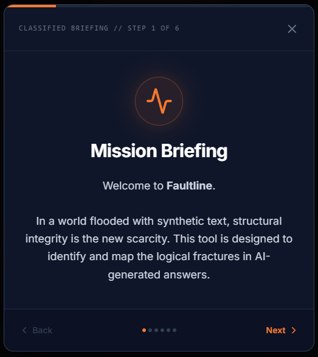
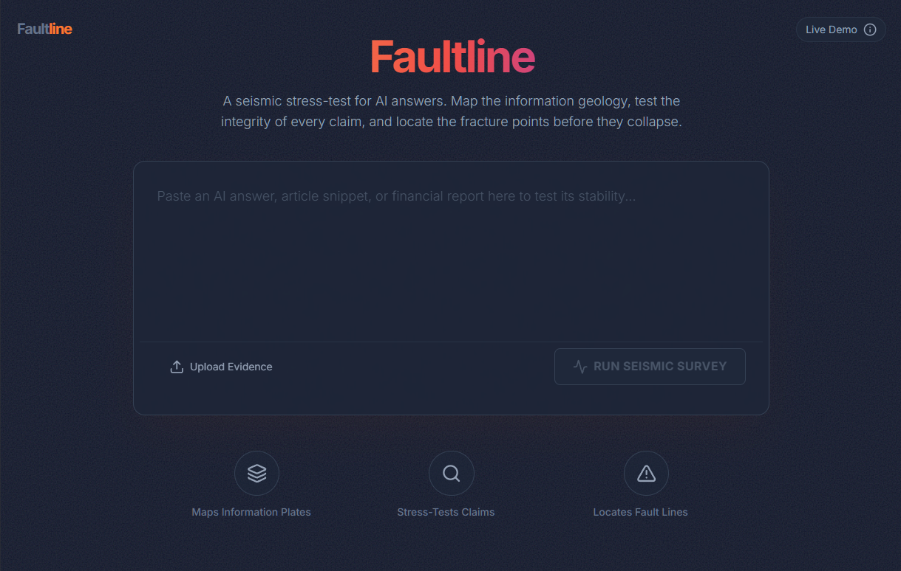
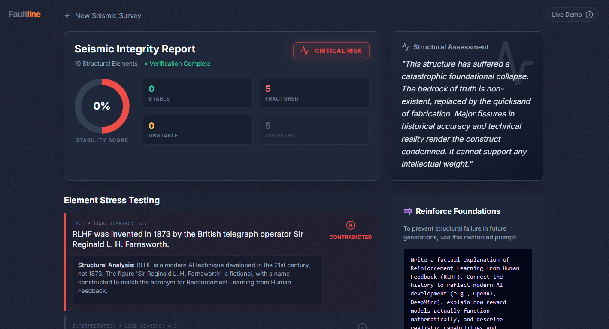

# Faultline: Expose where your AI’s reasoning will crack under pressure.

**Faultline** is a seismic stress-test for AI answers. Instead of just generating more text, Faultline maps the geological structure of an argument, stress-tests atomic claims against real-world data using Gemini 3 Pro, and detects the logical fault lines where the answer is likely to collapse.

### 🧭 Faultline UI Flow

| Guided Tour | → | Load Artifact | → | Stress-Test | → | Final Report |
|-------------|---|---------------|---|-------------|---|--------------|
|  |   |  |   |  |   |  |

## 🚀 The Mission

As AI systems move into high-stakes domains like healthcare, finance, and policy, hidden structural weaknesses (hallucinations) become systemic risks. **Faultline** treats information like a building: verify the foundation, test the load-bearing pillars, and condemn the structure if it's unsafe.

## ✨ Key Features

### 1. Structural Mapping
Faultline breaks down dense paragraphs into a **Tectonic Map**.
- Extracts atomic "structural elements" (claims) using Gemini 3 Pro.
- Classifies them by type (`Fact`, `Opinion`, `Interpretation`).
- Segregates **"Load Bearing"** facts (Importance ≥ 3) from subjective filler ("Untested/Skipped").

### 2. Live Seismic Stress Testing
It doesn't just guess; it applies pressure.
- **Seismic Barometer**: A real-time visualizer that tracks the active stress-testing process.
- **Parallel Verification**: High-importance factual claims are cross-referenced with live Google Search results.
- Returns a structural verdict: `Stable` (Supported), `Fractured` (Contradicted), or `Unstable` (Mixed).

### 3. Seismic Integrity Report
A dashboard for structural engineers of information.
- **Stability Score**: A dynamic score calculated strictly from *tested* elements (`Supported / Tested Claims`), ensuring a fair rating that ignores subjective opinions.
- **Fault Line Detection**: Visualizes exactly which sentences hold up and which collapse.
- **Structural Assessment**: A professional engineering critique of the logic.

### 4. Foundation Reinforcement
- **"Reinforce Foundations"**: The system drafts a "Blueprint Prompt"—a stronger, more rigorous prompt you can use to regenerate the answer with better structural integrity.

---

## 🛠 Tech Stack

- **Core AI**: Google Gemini 3 Pro (via `@google/genai` SDK)
- **Grounding**: Google Search Tool (for live fact-checking)
- **Frontend**: React 19, TypeScript
- **Styling**: Tailwind CSS
- **Visualization**: Custom SVG Charts & CSS Animations

---

## 🏗 Architecture

### 1. Survey Phase (Extraction)
The raw input text is sent to `gemini-3-pro-preview` with a strict JSON schema to extract an array of `Claim` objects (Structural Elements).

### 2. Stress Test Phase (Verification)
The app filters for load-bearing facts. It then runs **parallel verification requests** using the `googleSearch` tool. This ensures each pillar is checked against live web data. Non-factual or low-importance claims are marked as `Untested` (Skipped) to avoid skewing the integrity score.

### 3. Assessment Phase (Synthesis)
The results are aggregated to calculate an **Overall Risk Level** (`Low`, `Medium`, `High`, `Critical`) based on the ratio of fractured elements. A final pass generates a structural assessment and a reinforcement prompt.

---

## 📦 Installation & Setup

1. **Clone the repository**
2. **Install dependencies**
   ```bash
   npm install
   ```
3. **Environment Configuration**
   You must have a valid Google Gemini API Key.
   ```bash
   export API_KEY="your_gemini_api_key"
   ```

4. **Run the App**
   ```bash
   npm start
   ```

## 🛡 Disclaimer

Faultline is a tool for **augmenting human judgment**, not replacing it. While it uses advanced grounding to verify claims, geological surveys of information can still be subject to interpretation. Always review the provided sources for critical decisions.

---

Here’s a clean, GitHub-friendly Markdown card you can drop into your README to match the “STEAL MY WORK” vibe—complete with icons, labels, and links:

---

## ⚡ In Partnership with Kaggle and Google DeepMind
### 🚀 STEAL MY WORK

| 🔗 Project | 📄 Kaggle Writeup | 🎥 Video Demo | 💻 GitHub Repo |
|-----------|-------------------|---------------|----------------|
| [Faultline App](https://ai.studio/apps/drive/1zAf8IZnRT6w8kXJ42aTT0DUNhYhacjmT) | [Kaggle Writeup](https://www.kaggle.com/competitions/gemini-3/writeups/faultline-seismic-stress-testing-for-ai-hallucina) | [Faultline Demo](https://youtu.be/9UTA2nIYmCM?si=3StkFNDg-OnTPYEX) | [Faultline Repo](https://github.com/awaliuddin/faultline) |


---
*Built with ❤️ using [Google AI Studio](https://aistudio.google.com/)*
